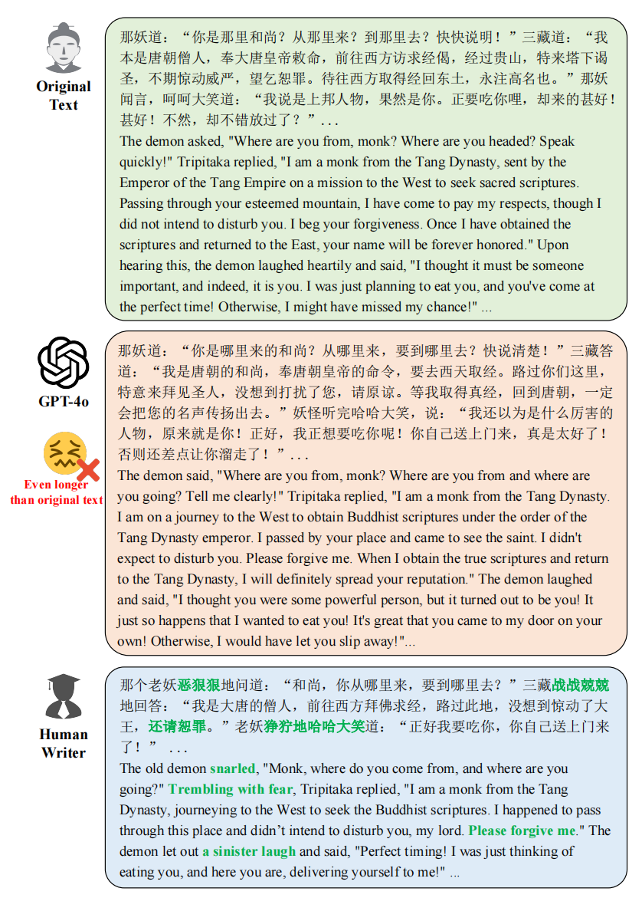
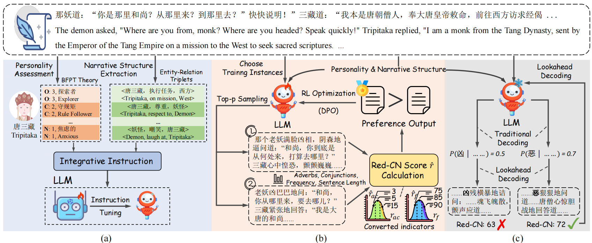

# Classic4Children

[📖 Paper](https://arxiv.org/abs/2502.01090)

<h3> 🎉 Accepted to NAACL 2025 Findings! 🎉 </h3>

This repo provides the source code of our paper: **Classic4Children: Adapting Chinese Literary Classics for Children with Large Language Model** (NAACL 2025)




##  :earth_asia: Abstract

Chinese literary classics hold significant cultural and educational value, offering deep insights into morality, history, and human nature. These works often include classical Chinese and complex narratives, making them difficult for children to read. To bridge this gap, we introduce a child-friendly literary adaptation (CLA) task to adapt the Chinese literary classic into engaging and accessible text for children. However, recent large language models (LLMs) overlook children’s reading preferences (*i.e.*, vivid character portrayals, concise narrative structures, and appropriate readability), which poses challenges in CLA. In this paper, we propose a method called InstructChild, which augments the LLM with these preferences for adaptation. Specifically, we first obtain the characters’ personalities and narrative structure as additional information for fine-grained instruction tuning. Then, we devise a readability metric as the reward to align the LLM with the children’s reading level. Finally, a lookahead decoding strategy is applied to improve the readability of the generated text during inference. To support the evaluation of CLA task, we construct the Classic4Children dataset, which comprises both the original and child-friendly versions of the Four Great Classical Novels of Chinese literature.


## :baby: Method



Overview of InstructChild. (a) fine-grained instruction tuning, which incorporates the characters’ personalities and narrative structure to fine-tune the large language model (LLM) with LoRA. (b) refinement with reinforcement learning, which considers a readability metric (*i.e.*, Red-CN) as a reward to further optimize the LLM to align with the children’s reading level. (c) lookahead decoding strategy, which extends the traditional decoding strategy with the readability score during inference.


We utilize [LLAMA-Factory](https://github.com/hiyouga/LLaMA-Factory) to fine-tune our model ([Qwen2-7B-Instruct](https://huggingface.co/Qwen/Qwen2-7B-Instruct)) with SFT and DPO


## :bow_and_arrow: Citation

```tex
@article{chen2025classic4children,
  title={Classic4Children: Adapting Chinese Literary Classics for Children with Large Language Model},
  author={Chen, Jiali and Hei, Xusen and Xue, Yuqi and Wu, Zihan and Xie, Jiayuan and Cai, Yi},
  journal={arXiv preprint arXiv:2502.01090},
  year={2025}
}
```
